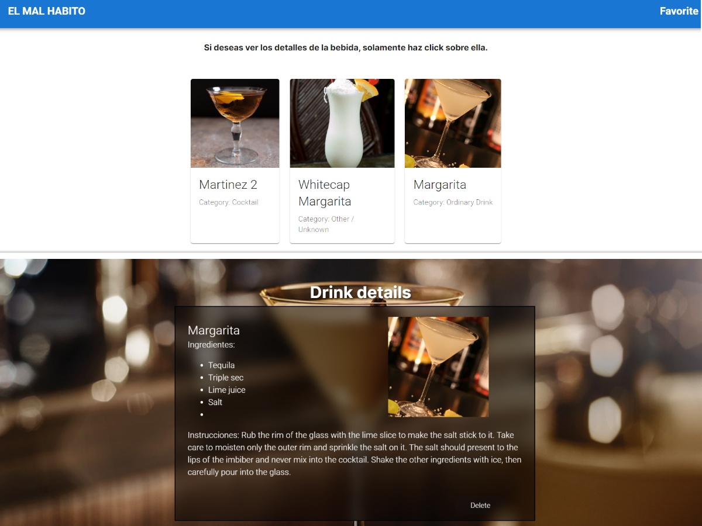

## EL MAL HABITO

ES UNA APP DONDE PUEDE BUSCAR BEBIDAS Y AGREGAR EN LA LISTA DE FAVORITOS PARA LUEGO VER LOS DETALLES DE LAS MISMAS

Tecnologias usadas:
- Uso del framework Nextjs para crear la aplicación web y gestionar la API externa.
- Como base de datos MongoDB para que al momento de ingresar a la app quede registrado que usuario es el que agrega la bebida
- Utilice Node y Express para crear el servidor proxy para gestionar la solicitud del cliente
  

 
